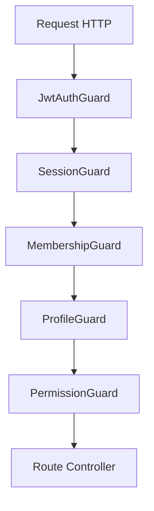

# 🛡️ Enterprise Security Architecture: Autenticação & Autorização

Este documento atua como **Especificação Oficial** da arquitetura de segurança da aplicação, implementada com **NestJS, Prisma ORM e PostgreSQL**. O modelo foi desenhado para escalabilidade (Multi-Tenant, Multi-Account), alta segurança (Validação de Sessão, JWT, Refresh Tokens) e controle de acesso granular (RBAC avançado com Overrides).

Toda a lógica de autorização e segurança segue rigorosamente os preceitos do **Domain-Driven Design (DDD)** e **Clean Architecture**, sendo totalmente agnóstica de acesso ao banco (Prisma) dentro da camada de Controllers ou Guards diretamente.

---

## 1. Pipeline de Execução (Security Pipeline)

Para garantir máxima segurança em profundidade, toda requisição autenticada passa por um *pipeline* estrito de validações (Guards) em cascata.



### O Fluxo de Hierarquia
O modelo de permissões e controle de acesso obedece à seguinte estrutura hierárquica:
`User` ➔ `Session` ➔ `Membership` ➔ `Profile` ➔ `ProfilePermission` ➔ `PermissionOverride` ➔ `Permission`

---

## 2. Request Context e Tipagens

Para garantir segurança tipada ao longo de toda a aplicação (evitando `any`), nós injetamos o contexto resolvido da requisição.

```typescript
// src/core/security/interfaces/request-context.interface.ts
import { Request } from 'express';

export interface UserContext {
  id: string;
  email: string;
}

export interface SessionContext {
  id: string;
  isActive: boolean;
}

export interface AccountContext {
  id: string;
  name: string;
  isActive: boolean;
}

export interface MembershipContext {
  id: string;
  accountId: string;
  userId: string;
  isActive: boolean;
}

export interface ProfileContext {
  id: string;
  name: string;
  isActive: boolean;
}

export interface AuthenticatedRequest extends Request {
  user: UserContext;
  session: SessionContext;
  account: AccountContext;
  membership: MembershipContext;
  profile: ProfileContext;
  permissions: string[];
}
```

---

## 3. Decorators de Segurança

Os Decorators extraem dados do Request e aplicam metadados às rotas.

### 3.1. Metadata Decorators

```typescript
// src/core/security/decorators/public.decorator.ts
import { SetMetadata } from '@nestjs/common';
export const IS_PUBLIC_KEY = 'isPublic';
export const Public = () => SetMetadata(IS_PUBLIC_KEY, true);

// src/core/security/decorators/permissions.decorator.ts
import { SetMetadata } from '@nestjs/common';
export const PERMISSIONS_KEY = 'permissions';
export const Permissions = (...permissions: string[]) => SetMetadata(PERMISSIONS_KEY, permissions);

// src/core/security/decorators/profiles.decorator.ts
import { SetMetadata } from '@nestjs/common';
export const PROFILES_KEY = 'profiles';
export const Profiles = (...profiles: string[]) => SetMetadata(PROFILES_KEY, profiles);
```

### 3.2. Context Param Decorators

```typescript
// src/core/security/decorators/current-user.decorator.ts
import { createParamDecorator, ExecutionContext } from '@nestjs/common';
import { AuthenticatedRequest } from '../interfaces/request-context.interface';

export const CurrentUser = createParamDecorator((data: unknown, ctx: ExecutionContext) => {
  return ctx.switchToHttp().getRequest<AuthenticatedRequest>().user;
});

export const CurrentAccount = createParamDecorator((data: unknown, ctx: ExecutionContext) => {
  return ctx.switchToHttp().getRequest<AuthenticatedRequest>().account;
});

export const CurrentMembership = createParamDecorator((data: unknown, ctx: ExecutionContext) => {
  return ctx.switchToHttp().getRequest<AuthenticatedRequest>().membership;
});

export const CurrentProfile = createParamDecorator((data: unknown, ctx: ExecutionContext) => {
  return ctx.switchToHttp().getRequest<AuthenticatedRequest>().profile;
});

export const CurrentPermissions = createParamDecorator((data: unknown, ctx: ExecutionContext) => {
  return ctx.switchToHttp().getRequest<AuthenticatedRequest>().permissions;
});
```

---

## 4. Guards

Os Guards implementam a lógica de restrição de cada etapa. **Nenhum Guard deve acessar o Prisma diretamente.** Toda a persistência é acessada por meio de Services (Dependency Injection).

### 4.1. JwtAuthGuard
```typescript
// src/core/security/guards/jwt-auth.guard.ts
import { ExecutionContext, Injectable, UnauthorizedException } from '@nestjs/common';
import { AuthGuard } from '@nestjs/passport';
import { Reflector } from '@nestjs/core';
import { IS_PUBLIC_KEY } from '../decorators/public.decorator';

@Injectable()
export class JwtAuthGuard extends AuthGuard('jwt') {
  constructor(private reflector: Reflector) {
    super();
  }

  canActivate(context: ExecutionContext) {
    const isPublic = this.reflector.getAllAndOverride<boolean>(IS_PUBLIC_KEY, [
      context.getHandler(),
      context.getClass(),
    ]);
    if (isPublic) return true;
    
    return super.canActivate(context);
  }

  handleRequest(err: any, user: any) {
    if (err || !user) {
      throw err || new UnauthorizedException('Token JWT inválido ou expirado.');
    }
    return user; // Injeta req.user
  }
}
```

### 4.2. SessionGuard
```typescript
// src/core/security/guards/session.guard.ts
import { Injectable, CanActivate, ExecutionContext, UnauthorizedException } from '@nestjs/common';
import { SessionService } from '../../session/session.service';

@Injectable()
export class SessionGuard implements CanActivate {
  constructor(private readonly sessionService: SessionService) {}

  async canActivate(context: ExecutionContext): Promise<boolean> {
    const request = context.switchToHttp().getRequest();
    const user = request.user;
    
    if (!user || !user.sessionId) throw new UnauthorizedException('Sessão inválida.');

    const session = await this.sessionService.validateSession(user.sessionId);
    if (!session || !session.isActive) {
      throw new UnauthorizedException('Sessão revogada ou expirada.');
    }
    
    request.session = session;
    return true;
  }
}
```

### 4.3. MembershipGuard
Valida se o usuário pertence à conta e injeta Membership, Account e Profile.
```typescript
// src/core/security/guards/membership.guard.ts
import { Injectable, CanActivate, ExecutionContext, ForbiddenException } from '@nestjs/common';
import { MembershipService } from '../../membership/membership.service';

@Injectable()
export class MembershipGuard implements CanActivate {
  constructor(private readonly membershipService: MembershipService) {}

  async canActivate(context: ExecutionContext): Promise<boolean> {
    const request = context.switchToHttp().getRequest();
    const accountId = request.headers['x-account-id']; // Exemplo de Account Resolution
    
    if (!accountId) throw new ForbiddenException('Contexto de conta não fornecido.');

    const membership = await this.membershipService.getActiveMembership(request.user.id, accountId);
    if (!membership) {
      throw new ForbiddenException('Usuário não pertence a esta conta ou acesso inativo.');
    }

    if (!membership.account.isActive) throw new ForbiddenException('A conta está inativa.');

    request.account = membership.account;
    request.profile = membership.profile;
    request.membership = membership;

    return true;
  }
}
```

### 4.4. PermissionGuard
Lê o metadado `@Permissions()`, resolve as permissões e calcula a liberação.
```typescript
// src/core/security/guards/permission.guard.ts
import { Injectable, CanActivate, ExecutionContext, ForbiddenException } from '@nestjs/common';
import { Reflector } from '@nestjs/core';
import { PERMISSIONS_KEY } from '../decorators/permissions.decorator';
import { AuthorizationService } from '../services/authorization.service';

@Injectable()
export class PermissionGuard implements CanActivate {
  constructor(
    private readonly reflector: Reflector,
    private readonly authService: AuthorizationService
  ) {}

  async canActivate(context: ExecutionContext): Promise<boolean> {
    const requiredPermissions = this.reflector.getAllAndOverride<string[]>(PERMISSIONS_KEY, [
      context.getHandler(),
      context.getClass(),
    ]);

    if (!requiredPermissions || requiredPermissions.length === 0) return true;

    const request = context.switchToHttp().getRequest();
    
    // Resolve e faz Cache as permissões finais do usuário
    const userPermissions = await this.authService.calculatePermissions(request.membership.id);
    request.permissions = userPermissions;

    const hasPermission = requiredPermissions.every((perm) => userPermissions.includes(perm));

    if (!hasPermission) {
      throw new ForbiddenException('Permissão negada. Acesso restrito.');
    }

    return true;
  }
}
```

---

## 5. Authorization Service (Permission Resolution)

Serviço Core responsável por calcular permissões.
### Fluxo de Resolução:
Profile ➔ Base Permissions ➔ Overrides (Add/Deny) ➔ Final Output

```typescript
// src/core/security/services/authorization.service.ts
import { Injectable, Inject } from '@nestjs/common';
import { CACHE_MANAGER } from '@nestjs/cache-manager';
import { Cache } from 'cache-manager';
import { MembershipRepository } from '../../membership/repositories/membership.repository';

@Injectable()
export class AuthorizationService {
  constructor(
    @Inject(CACHE_MANAGER) private cacheManager: Cache,
    private readonly membershipRepository: MembershipRepository
  ) {}

  async calculatePermissions(membershipId: string): Promise<string[]> {
    const cacheKey = `permissions:membership:${membershipId}`;
    const cachedPermissions = await this.cacheManager.get<string[]>(cacheKey);
    
    if (cachedPermissions) return cachedPermissions;

    // 1. Busca perfil e suas permissões padrões
    const basePermissions = await this.membershipRepository.getProfilePermissions(membershipId);
    
    // 2. Busca overrides da membership pontual (isDenied true ou false)
    const overrides = await this.membershipRepository.getPermissionOverrides(membershipId);

    // 3. Aplica o algoritmo de Resolução
    const finalPermissions = new Set<string>(basePermissions.map(p => p.code));

    for (const override of overrides) {
      if (override.isDenied) {
        finalPermissions.delete(override.code);
      } else {
        finalPermissions.add(override.code);
      }
    }

    const resolvedPermissions = Array.from(finalPermissions);
    
    // Armazena no Redis por 1h
    await this.cacheManager.set(cacheKey, resolvedPermissions, 3600);
    
    return resolvedPermissions;
  }
}
```

---

## 6. Tratamento de Exceções (Custom Exceptions)

Padronizar as exceções melhora o monitoramento e simplifica a vida do front-end.

**401 Unauthorized:**
- `InvalidTokenException` (Token malformado)
- `TokenExpiredException` (Validade JWT alcançada)
- `SessionExpiredException` (Refresh Token expirado)
- `SessionRevokedException` (Sessão encerrada por terceiros/admin)

**403 Forbidden:**
- `MembershipInvalidException` (Membro bloqueado ou removido)
- `AccountInactiveException` (Conta Tenant suspensa)
- `UserBlockedException` (Usuário master inativo)
- `PermissionDeniedException` (Falta `users.read`, etc)
- `ProfileInvalidException` (Perfil não atende ao `@Profiles()`)

---

## 7. Cache de Autorização (Redis)

Evite o acesso ao banco em toda requisição de API.
A invalidação do cache (`this.cacheManager.del('permissions:membership:ID')`) deve ocorrer obrigatoriamente quando:
- Administrador edita o `Profile` de acesso.
- Administrador adiciona/remove um `PermissionOverride`.
- Conta do Tenant é suspensa ou desativada.
- O status de ativação da `Membership` muda.

---

## 8. Segurança Adicional (Boas Práticas)

- **Passport / JWT:** Secret gerado usando 256 bits (`HS256` ou `RS256`).
- **Refresh Token Rotation:** Quando emitido novo token de acesso, descartar o Refresh antigo e emitir um novo. Detectar reuso de refresh revoga todos os tokens instantaneamente.
- **Helmet:** Omitir headers (`X-Powered-By`), adicionar HSTS.
- **Rate Limit:** Usar `@nestjs/throttler`. Restringir duramente endpoints sensíveis (`/auth/login`).
- **CSRF:** Necessário caso decida adotar validação por Cookies `HttpOnly`. (Se o app operar somente com Bearer Headers originados de apps mobiles/SaaS puros, pode-se usar anti-CSRF tokens apenas em fluxos web SSR).

---

## 9. Logs e Auditoria

Todas ações vitais de segurança devem logar no sistema interno (ex: DataDog, ELK, ou arquivo local estruturado em JSON):
- `EVENT_LOGIN_SUCCESS` / `EVENT_LOGIN_FAILED`
- `EVENT_LOGOUT` / `EVENT_SESSION_REVOKED`
- `EVENT_ACCOUNT_SWITCHED` (Quando o User transita de Conta A para Conta B)
- `EVENT_PERMISSION_DENIED` (Útil para detecção precoce de intrusos escalando privilégios)

---

## 10. Documentação no Swagger

Para simplificar a leitura por desenvolvedores client-side, crie um decorator agregado para o Swagger:

```typescript
import { applyDecorators } from '@nestjs/common';
import { ApiBearerAuth, ApiUnauthorizedResponse, ApiForbiddenResponse } from '@nestjs/swagger';

export function ApiSecurityDocs() {
  return applyDecorators(
    ApiBearerAuth(),
    ApiUnauthorizedResponse({ description: 'Acesso Não Autorizado. Token inválido, expirado ou sessão morta.' }),
    ApiForbiddenResponse({ description: 'Acesso Negado. Sem permissão, profile incompatível ou conta bloqueada.' })
  );
}
```

---

## 11. Testes de Segurança (QA)

### Unitários
- **JwtAuthGuard**: Injetar Request modificado; Validar passagem quando houver `@Public()`.
- **PermissionGuard**: Mockar dependência do `AuthorizationService`, simular retornos variados (`users.read`, `users.write`) e cruzar com os valores do `Reflector`.
- **AuthorizationService**: Validar lógica matemática: (`BasePermissions` + `Overrides(Allow)` - `Overrides(Deny)` = Resultado Exato).

### Integração / E2E
- **Autenticação**: Submeter credenciais, receber JWT e Refresh Token. Submeter credenciais incorretas, aguardar erro e Rate Limit.
- **Troca de Conta**: Passar `X-Account-Id` de um Tenant que o usuário não faz parte, afirmar o 403. Mudar para um válido e validar recebimento do novo contexto.
- **Overrides**: Criar usuário tipo `Analyst`, dar `Override: Deny` no delete, chamar endpoint de `DELETE /users`, esperar erro `403`.

---
**Fim da Especificação Arquitetural de Segurança**
